# 教学管理系统 HarmonyOS App

## 项目介绍

本项目是“绷住了小组”的软件工程课程作业，目标是实现一个面向 HarmonyOS NEXT 的教学管理系统 App。

系统围绕学生端与管理端两类角色设计，覆盖登录注册、首页工作台、课程课表、选课中心、成绩考试、评教反馈、请假实践、学生管理、课程管理、成绩管理、通知发布和审批管理等教学管理核心场景。

## 项目定位

- **项目名称**：教学管理系统 HarmonyOS App
- **目标平台**：HarmonyOS NEXT
- **项目类型**：软件工程课程作业
- **设计风格**：Elysia 玫瑰学院风
- **视觉主题**：玫瑰粉 `#F2709C`、奶油白 `#FFFDFB`、浅紫 `#B589FF`、金色 `#D9B675`

## 软件架构

当前仓库为 HarmonyOS 工程结构，主要目录如下：

```text
.
├── AppScope/                 # 应用级配置与资源
├── entry/                    # HarmonyOS 主模块
│   ├── src/main/ets/         # 页面与 Ability 代码
│   ├── src/main/resources/   # 应用资源
│   ├── src/ohosTest/         # OHOS 测试
│   └── src/test/             # 本地单元测试
├── hvigor/                   # Hvigor 构建配置
├── UI设计图/                 # UI 设计源文件
├── UI设计图片/               # README 中引用的 UI 页面展示图片
├── build-profile.json5       # 工程构建配置
├── hvigorfile.ts             # Hvigor 入口配置
└── oh-package.json5          # OpenHarmony 包配置
```

## 功能模块

### 学生端

- 用户认证：登录、注册、忘记密码
- 首页工作台：教学周信息、快捷入口、今日课程、通知摘要
- 课程模块：我的课表、课程详情、选课中心
- 学业信息：成绩查询、考试安排、学籍信息
- 评教与杂项：评教问卷、请假申请、意见反馈、实践公服
- 个人中心：个人信息、账户安全、资料修改、密码修改、系统设置

### 管理端

- 管理员认证：工号密码登录、图形验证码
- 管理仪表盘：统计卡片、选课趋势、课程类型分布
- 学生管理：学生列表、搜索筛选、学籍操作
- 课程管理：课程新增、编辑、删除
- 选课管理：选课数据统计、人工调整
- 成绩管理：成绩录入、成绩审核
- 通知发布：通知编辑、发布范围选择
- 审批管理：审批中心、审批详情、通过与驳回操作

## UI 页面设计展示

文档版本：V1.1  
设计风格：Elysia 玫瑰学院风  
目标平台：HarmonyOS NEXT  
色彩主题：玫瑰粉 `#F2709C` · 奶油白 `#FFFDFB` · 浅紫 `#B589FF` · 金色 `#D9B675`

### 一、认证页面

学生端与管理端均采用玫瑰学院风视觉语言。学生端使用学号密码登录，管理端增加图形验证码。

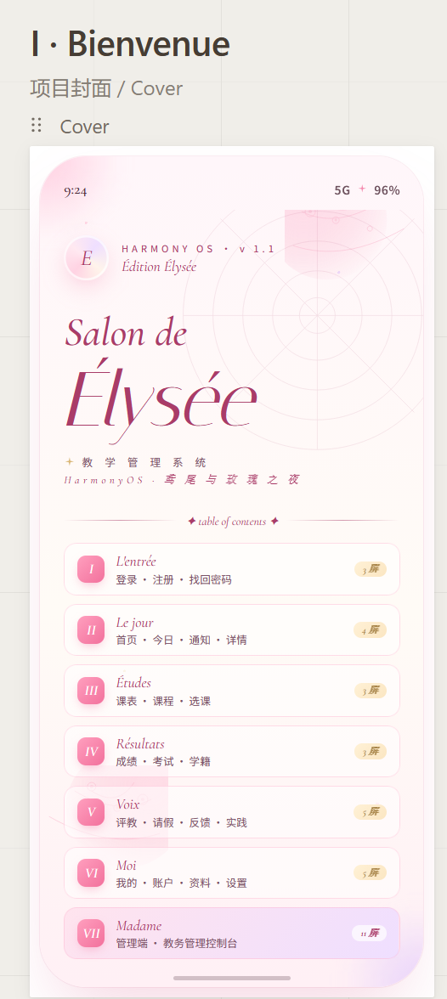

**包含页面：**

- 学生登录 LoginScreen：品牌 Logo + 欢迎语 + 学号/密码输入 + 登录按钮（玫瑰渐变胶囊）
- 注册 RegisterScreen：新用户注册表单
- 忘记密码 ForgotScreen：密码找回流程

### 二、学生端首页

首页以教学周卡片、快捷入口网格、今日课程列表和通知摘要组织高频信息。

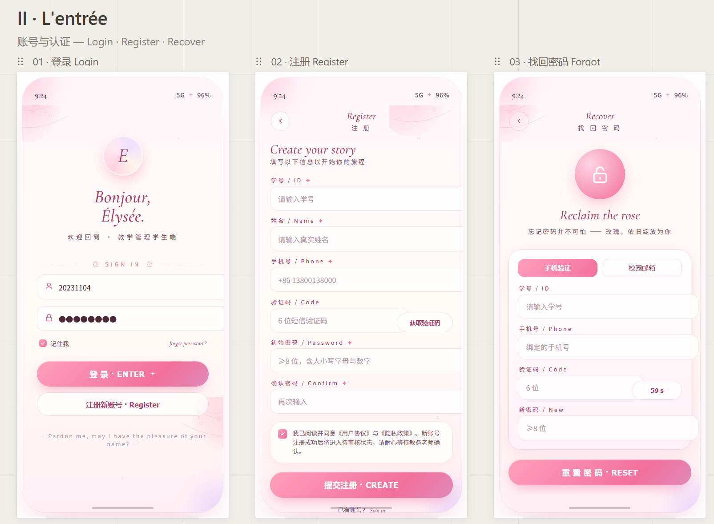

**包含页面：**

- 首页工作台 HomeScreen：欢迎区 + Hero 教学周卡片 + 快捷入口 + 今日课程 + 通知摘要
- 今日课程 TodayScreen：时间线形式展示当天全部课程
- 通知列表 NotificationsScreen：分类标签 + 通知卡片列表
- 通知详情 NoticeDetailScreen：通知正文展示

### 三、课程模块

课表以周视图呈现，选课中心支持分类筛选与搜索。

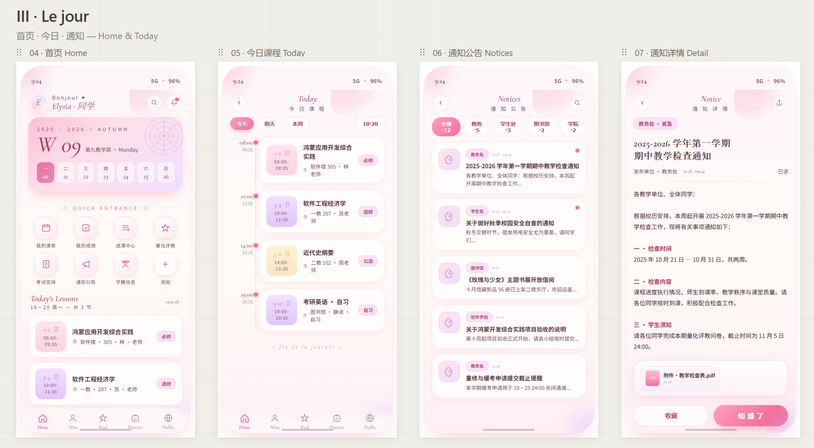

**包含页面：**

- 我的课表 ScheduleScreen：周视图课程表，颜色区分课程类型
- 课程详情 CourseDetailScreen：课程信息 + 教师 + 学分 + 考核方式
- 选课中心 SelectionScreen：分类筛选 + 课程卡片 + 选课操作

### 四、学业信息

成绩查询、考试安排与学籍信息集中展示。

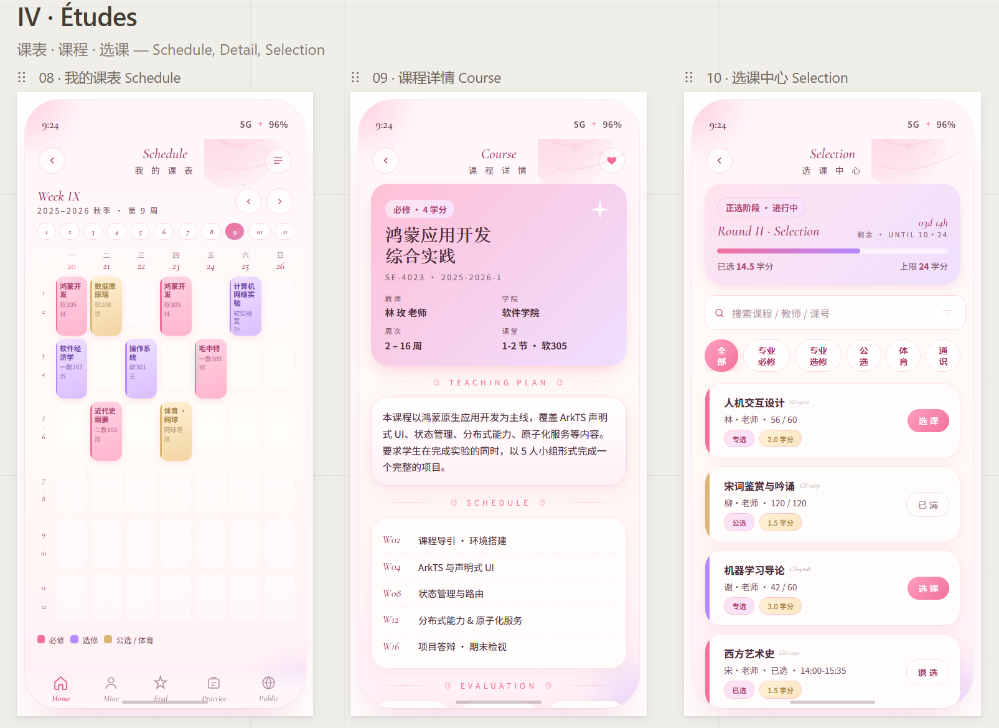

**包含页面：**

- 成绩查询 GradesScreen：学期筛选 + 课程成绩列表 + GPA 统计
- 考试安排 ExamScreen：考试时间线 + 考场信息
- 学籍信息 RosterScreen：个人学籍档案展示

### 五、评教与杂项功能

评教、请假、反馈、实践等辅助功能。

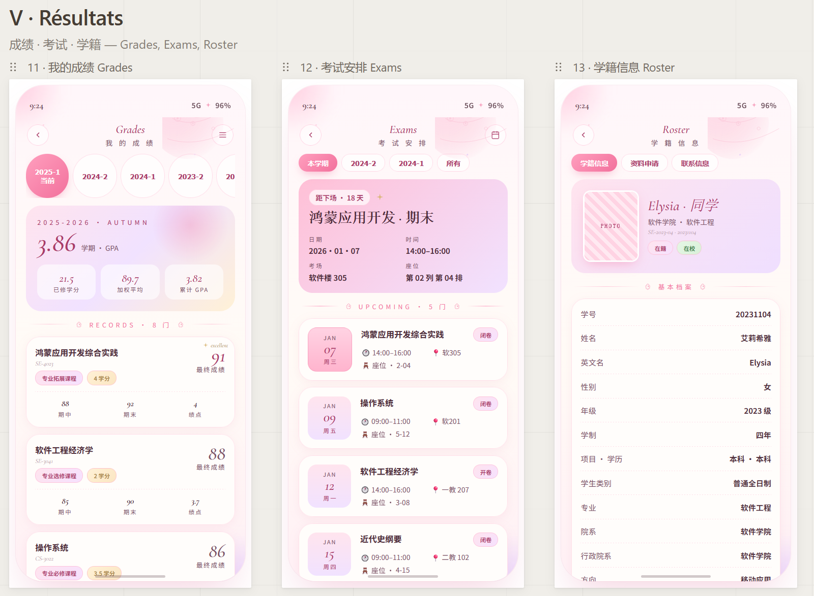

**包含页面：**

- 评教列表 EvalListScreen：待评教课程列表
- 评教问卷 EvalFormScreen：评分滑块 + 文字评价
- 请假申请 LeaveScreen：请假类型 + 时间选择 + 原因填写
- 意见反馈 FeedbackScreen：反馈类型 + 内容输入
- 实践公服 PracticeScreen：实践活动列表与报名

### 六、个人中心

个人信息管理、账户安全与应用设置。

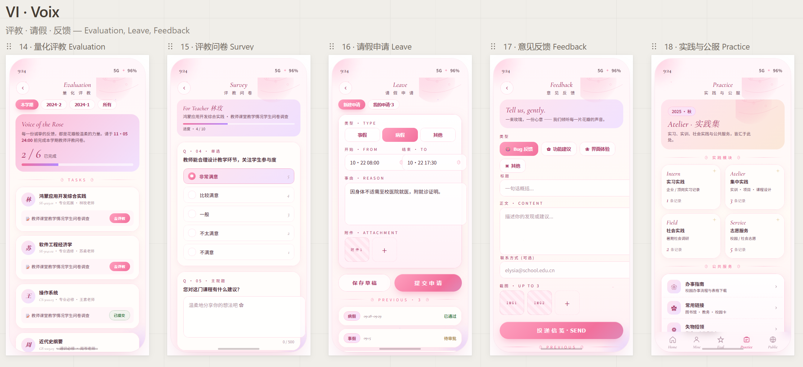

**包含页面：**

- 我的 MineScreen：头像 + 基本信息 + 功能入口列表
- 我的账户 AccountScreen：账户详细信息
- 修改资料 EditInfoScreen：个人信息编辑表单
- 修改密码 PasswordScreen：旧密码验证 + 新密码设置
- 设置 SettingsScreen：主题切换 + 通知开关 + 关于

### 七、管理端 — 登录与仪表盘

管理端保留同一套玫瑰主题，信息密度更高，突出统计数据、图表和审批操作。

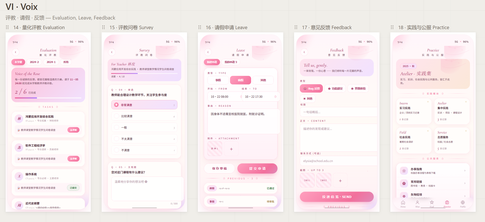

**包含页面：**

- 管理员登录 AdminLogin：`ADMIN · 教务` 标识 + 工号/密码 + 图形验证码
- 管理仪表盘 AdminDashboard：四宫格统计卡 + 选课趋势图 + 课程类型分布
- 学生管理 AdminStudents：学生列表 + 搜索筛选 + 学籍操作

### 八、管理端 — 课程与成绩管理

课程、选课、成绩、通知的集中管理。

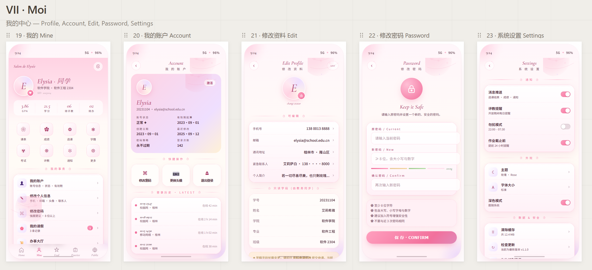

**包含页面：**

- 课程管理 AdminCourses：课程列表 + 新增/编辑/删除
- 选课管理 AdminSelection：选课数据统计 + 人工调整
- 成绩管理 AdminGrades：批量录入 + 成绩审核
- 通知发布 AdminNotice：通知编辑器 + 发布范围选择

### 九、管理端 — 评教与审批

评教数据管理与审批流程处理。

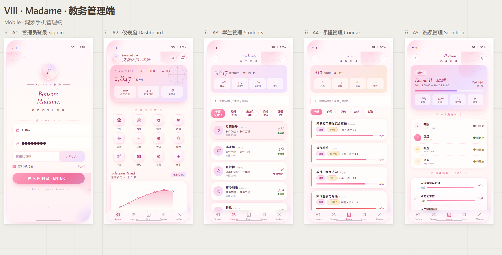

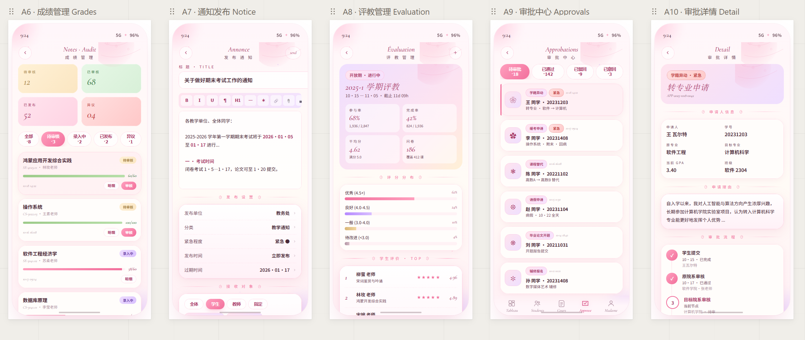

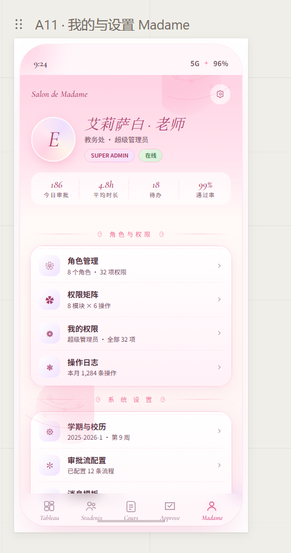

**包含页面：**

- 评教管理 AdminEval：评教数据汇总 + 统计分析
- 审批中心 AdminApprovals：待审批/已通过/已驳回/已撤回筛选 + 审批卡片列表
- 审批详情 AdminApprovalDetail：申请详情 + 审批操作（通过/驳回）
- 管理员中心 AdminProfile：管理员个人信息与系统设置

## 设计 Token 速查

### 色彩

| 名称 | 色值 | 用途 |
| --- | --- | --- |
| rose-500 | `#F2709C` | 主按钮、激活态、重点文字 |
| rose-700 | `#A93C68` | 标题、强调 |
| rose-100 | `#FFE9F1` | 卡片背景、标签底色 |
| cream-50 | `#FFFBF6` | 页面主背景 |
| surface | `#FFFDFB` | 卡片、输入框 |
| lav-500 | `#B589FF` | 辅助渐变、选修标识 |
| gold-500 | `#D9B675` | 高分、公选标识 |
| ink | `#4B2A38` | 正文主文字 |
| ink-soft | `#7A5266` | 说明文字 |
| ink-mute | `#B294A4` | 时间、辅助 |

### 圆角

| 组件 | 圆角值 |
| --- | --- |
| 手机壳 | 36px |
| Hero 卡片 | 24px |
| 普通卡片 | 18px |
| 输入框 | 14px |
| 按钮 | 999px（胶囊） |
| 快捷入口图标 | 12-15px |
| 标签 | 999px（胶囊） |

### 底部导航

| 角色 | Tab 1 | Tab 2 | Tab 3 | Tab 4 | Tab 5 |
| --- | --- | --- | --- | --- | --- |
| 学生端 | Home 首页 | Mine 我的 | Eval 评教 | Practice 实践 | Public 公共 |
| 管理端 | Tableau 仪表 | Students 学生 | Cours 课程 | Approve 审批 | Madame 我的 |

## 完整页面清单

| 序号 | 页面 | 角色 | 来源文件 |
| --- | --- | --- | --- |
| 1 | 学生登录 LoginScreen | 学生 | screens-auth.jsx |
| 2 | 注册 RegisterScreen | 学生 | screens-auth.jsx |
| 3 | 忘记密码 ForgotScreen | 学生 | screens-auth.jsx |
| 4 | 首页工作台 HomeScreen | 学生 | screens-home.jsx |
| 5 | 今日课程 TodayScreen | 学生 | screens-home.jsx |
| 6 | 通知列表 NotificationsScreen | 学生 | screens-home.jsx |
| 7 | 通知详情 NoticeDetailScreen | 学生 | screens-home.jsx |
| 8 | 我的课表 ScheduleScreen | 学生 | screens-courses.jsx |
| 9 | 课程详情 CourseDetailScreen | 学生 | screens-courses.jsx |
| 10 | 选课中心 SelectionScreen | 学生 | screens-courses.jsx |
| 11 | 成绩查询 GradesScreen | 学生 | screens-academics.jsx |
| 12 | 考试安排 ExamScreen | 学生 | screens-academics.jsx |
| 13 | 学籍信息 RosterScreen | 学生 | screens-academics.jsx |
| 14 | 评教列表 EvalListScreen | 学生 | screens-misc.jsx |
| 15 | 评教问卷 EvalFormScreen | 学生 | screens-misc.jsx |
| 16 | 请假申请 LeaveScreen | 学生 | screens-misc.jsx |
| 17 | 意见反馈 FeedbackScreen | 学生 | screens-misc.jsx |
| 18 | 实践公服 PracticeScreen | 学生 | screens-misc.jsx |
| 19 | 我的 MineScreen | 学生 | screens-profile.jsx |
| 20 | 我的账户 AccountScreen | 学生 | screens-profile.jsx |
| 21 | 修改资料 EditInfoScreen | 学生 | screens-profile.jsx |
| 22 | 修改密码 PasswordScreen | 学生 | screens-profile.jsx |
| 23 | 设置 SettingsScreen | 学生 | screens-profile.jsx |
| 24 | 管理员登录 AdminLogin | 管理员 | screens-admin-m1.jsx |
| 25 | 管理仪表盘 AdminDashboard | 管理员 | screens-admin-m1.jsx |
| 26 | 学生管理 AdminStudents | 管理员 | screens-admin-m1.jsx |
| 27 | 课程管理 AdminCourses | 管理员 | screens-admin-m2.jsx |
| 28 | 选课管理 AdminSelection | 管理员 | screens-admin-m2.jsx |
| 29 | 成绩管理 AdminGrades | 管理员 | screens-admin-m2.jsx |
| 30 | 通知发布 AdminNotice | 管理员 | screens-admin-m2.jsx |
| 31 | 评教管理 AdminEval | 管理员 | screens-admin-m3.jsx |
| 32 | 审批中心 AdminApprovals | 管理员 | screens-admin-m3.jsx |
| 33 | 审批详情 AdminApprovalDetail | 管理员 | screens-admin-m3.jsx |
| 34 | 管理员中心 AdminProfile | 管理员 | screens-admin-m3.jsx |

## 安装与运行

1. 使用 DevEco Studio 打开本项目根目录。
2. 等待工程依赖同步完成。
3. 选择 `entry` 模块。
4. 连接 HarmonyOS 设备或启动模拟器。
5. 点击运行按钮进行构建与安装。

## 使用说明

- 学生端用于完成课程查看、选课、成绩考试查询、评教反馈、请假实践和个人信息管理。
- 管理端用于完成学生、课程、选课、成绩、通知和审批流程管理。
- README 中的 UI 截图位于 `UI设计图片/` 目录下，查看仓库首页或使用 Markdown 预览时会自动引用这些图片。

## 参与贡献

**绷住了小组成员：**

- 绷住了-李仕炜
- 绷住了-郑力辉
- 绷住了-毛坤强
- 绷住了-邵长烨
