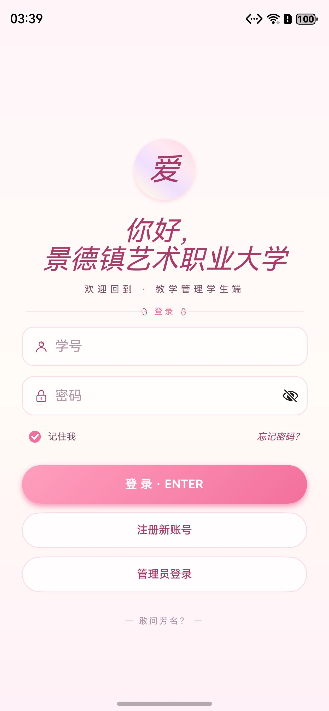
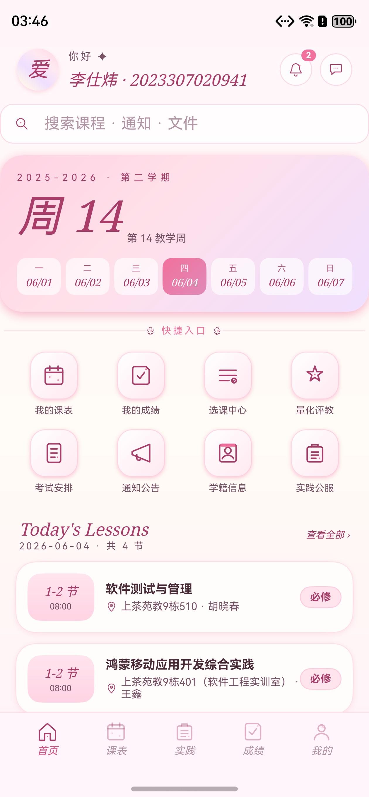
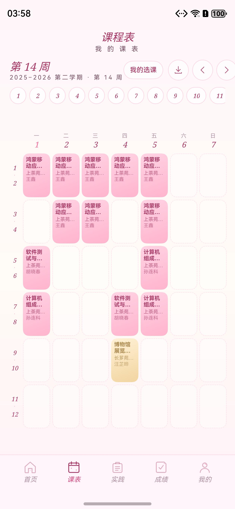
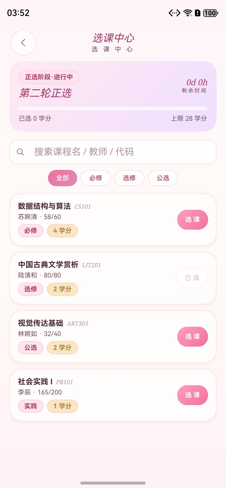
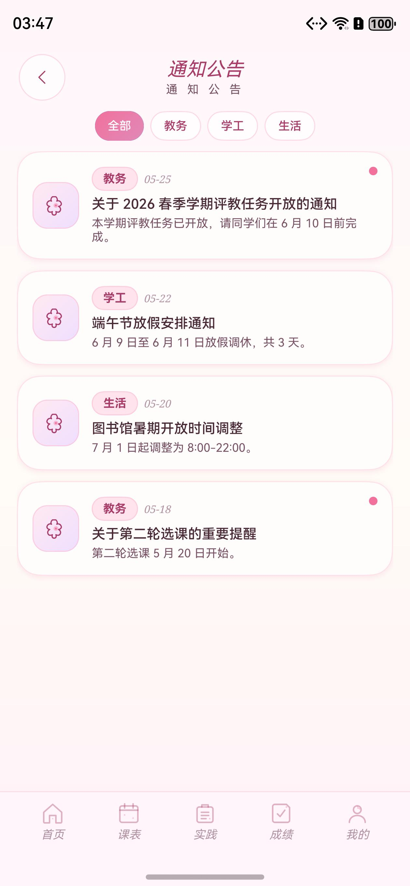
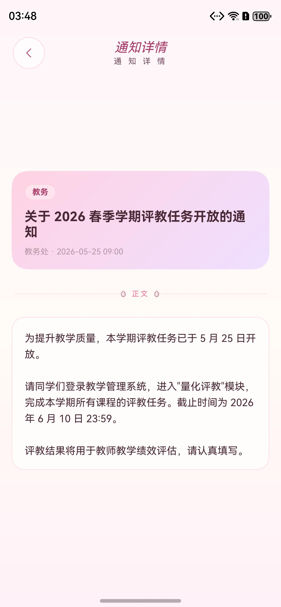
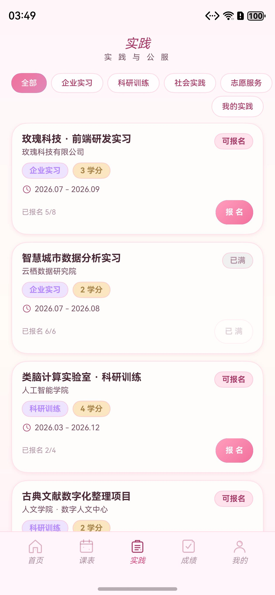
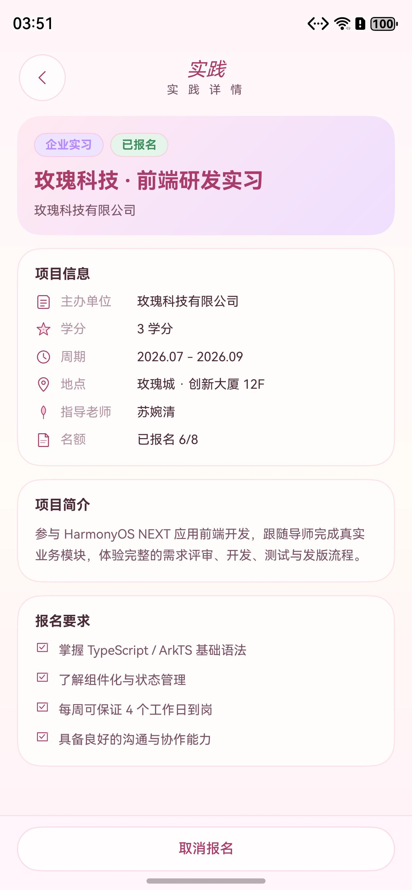

# 教学管理系统 HarmonyOS App

## 后端部署教程（从零到上线）

> 目标架构：**公网仅开放 80/443 → nginx（TLS 终止）→ 本机 Node `:8090`（pm2 守护）→ Postgres 容器**。
> 线上实例：API `https://lsw666.dns.army/api`，Web 管理控制台 `https://lsw666.dns.army/admin/`。
> 以下步骤在一台全新 Linux 服务器（线上为 Ubuntu）上从零复现整套后端。

### 第 0 步 · 前置条件

- 一台有公网 IP 的 Linux 服务器，以及一个已解析到该 IP 的域名（HTTPS 证书需要）
- 服务器安装：**Node.js ≥ 18**、**Docker**（跑 Postgres）、**nginx**、**certbot**

```bash
sudo apt update
sudo apt install -y nginx certbot python3-certbot-nginx docker.io
# Node 18+（若发行版自带版本过旧，用 NodeSource 或 nvm 安装）
node -v   # 应 >= v18
```

### 第 1 步 · 启动 Postgres 容器

```bash
sudo docker run -d --name dtest2-postgres \
  -e POSTGRES_DB=dtest2_harmony \
  -e POSTGRES_USER=dtest2_app \
  -e POSTGRES_PASSWORD='<一个强密码>' \
  -p 127.0.0.1:15432:5432 \
  --restart unless-stopped \
  postgres:16
```

> ⚠️ **容器网络坑（线上踩过）**：部分环境下 host 上的 `127.0.0.1:15432` 端口映射不可用（TCP 能握手但 pg 报 `Connection terminated`）。此时改用**容器 bridge IP** 直连：
>
> ```bash
> sudo docker inspect -f '{{range .NetworkSettings.Networks}}{{.IPAddress}}{{end}}' dtest2-postgres
> ```
>
> 把查到的 IP（如 `172.17.0.2`）填入 `.env` 的 `PGHOST`、`PGPORT=15432`。**容器重启可能换 IP**——若日后 `/health` 突然报 db 错误，先重查此 IP 并更新 `.env`。

### 第 2 步 · 上传代码并安装依赖

```bash
# 本地：把仓库 server/ 目录上传到服务器
scp -r server/* <user>@<服务器IP>:~/dtest2-api/

# 服务器：
cd ~/dtest2-api
npm install --omit=dev   # express / pg / jsonwebtoken / bcryptjs / nodemailer / dotenv / cors
```

### 第 3 步 · 配置环境变量（`.env`）

```bash
cd ~/dtest2-api
cp .env.example .env
vim .env
```

逐项填写（**`.env` 绝不入库**，模板见 `server/.env.example`）：

| 变量 | 说明 |
|---|---|
| `PORT` | 后端监听端口，默认 `8090` |
| `PGHOST` / `PGPORT` | Postgres 地址：优先 `127.0.0.1:15432`，映射不通则用容器 bridge IP（见第 1 步） |
| `PGDATABASE` / `PGUSER` / `PGPASSWORD` | `dtest2_harmony` / `dtest2_app` / 第 1 步设置的密码 |
| `JWT_SECRET` | **必填**，≥16 字符随机串（建议 64）；缺失或过短服务**拒绝启动**。生成：`openssl rand -hex 32` |
| `SMTP_HOST` / `SMTP_PORT` / `SMTP_SECURE` | QQ 邮箱 SMTP：`smtp.qq.com` / `465` / `true` |
| `SMTP_SENDER_EMAIL` / `SMTP_SENDER_PASSWORD` | 发件邮箱 + QQ 邮箱**授权码**（在 QQ 邮箱设置→账户→开启 SMTP 获取，不是登录密码） |
| `CORS_ORIGINS` | 留空=关闭跨域（原生 App 不受 CORS 约束，无需配置） |
| `RATE_LIMIT_*` | 限流阈值，可不改（全局 300/分·IP，登录与验证码 10/分·IP） |

### 第 4 步 · 建库迁移 + 导入基础数据

```bash
cd ~/dtest2-api          # ⚠️ 必须在此目录运行（dotenv 按当前目录找 .env）
npm run migrate          # 幂等应用 migrations/001~006：31 表全量建表 + 班级名册表 +
                         # 班级课表表 + 成绩两段式发布 + 系统配置表 + 名册学院/专业列
npm run seed             # 演示账号 / 选课轮次 / 评教模板（幂等可重跑）
node scripts/import-class-students.js     # 班级学生名册 47 人（注册白名单）
node scripts/import-class-schedule.js     # 班级课表 40 条 + 课程-教师绑定
node scripts/import-class-eval-tasks.js   # 评教任务（已注册学生 × 本班课程）
node scripts/import-class-grade-tasks.js  # 成绩录入任务（班级课程）
node scripts/import-school-calendar.js    # 真实校历节点（两学期 25 条）
```

所有导入脚本均为 UPSERT 幂等设计，重复运行安全；迁移 runner 按 `schema_migrations` 登记跳过已应用版本。

### 第 5 步 · pm2 守护进程

```bash
sudo npm i -g pm2
cd ~/dtest2-api
pm2 start src/index.js --name dtest2-api
pm2 save              # 持久化进程列表
pm2 startup           # 生成开机自启命令（按提示执行一次）

# 本机验证
curl http://127.0.0.1:8090/health   # 应返回 {"success":true,...,"db":"ok"}
```

### 第 6 步 · nginx 反代 + HTTPS

```bash
sudo certbot --nginx -d <你的域名>   # 申请 Let's Encrypt 证书（自动续期）
```

在该域名的 443 server 块中加两个 location（完整样板见
[`server/deploy/nginx-https-setup.md`](server/deploy/nginx-https-setup.md) 与
[`server/deploy/nginx-admin-block.conf`](server/deploy/nginx-admin-block.conf)）：

```nginx
location /api/ {
    proxy_pass http://127.0.0.1:8090;
    proxy_set_header Host $host;
    proxy_set_header X-Real-IP $remote_addr;
    proxy_set_header X-Forwarded-For $proxy_add_x_forwarded_for;
    proxy_set_header X-Forwarded-Proto $scheme;
}
location /admin {
    proxy_pass http://127.0.0.1:8090;
    proxy_set_header Host $host;
}
```

```bash
sudo nginx -t && sudo systemctl reload nginx
```

**防火墙/云安全组只放行 80/443**；`8090` 不对公网开放——后端已设 `trust proxy loopback`，仅信任本机 nginx 转发的真实 IP（用于限流与审计）。

### 第 7 步 · 上线验证

```bash
curl https://<你的域名>/api/health
curl -s -X POST https://<你的域名>/api/auth/login \
  -H 'Content-Type: application/json' \
  -d '{"account":"<管理员工号>","password":"<密码>"}'
```

- 浏览器打开 `https://<你的域名>/admin/`，用管理员账号登录 Web 管理控制台（概览 / 学生 / 选课 / 成绩 / 审批 / 通知 / 验证码监控 / 审计 / 数据库管理）。
- App 侧把 `entry/src/main/ets/common/AppConfig.ets` 的 `baseUrl` 改为 `https://<你的域名>/api` 后重新构建即可联机。

### 第 8 步 · 日常更新与运维

- **更新部署固定流程**：备份（`cp -r src src.bak.$(date +%s)`）→ 上传改动文件 → `node --check <文件>` 语法校验 → `pm2 restart dtest2-api` → `curl /health` + 登录验证；失败即用备份回滚。
- **日志与状态**：`pm2 logs dtest2-api` / `pm2 ls`；500 错误详情只记服务端日志，客户端仅见通用文案。
- **新增数据库迁移**：上传 `migrations/00X_*.sql` 后执行 `npm run migrate`（幂等，已应用自动跳过）。
- **常见故障**：`/health` 报 db 错误 → 大概率是 Postgres 容器重启后 bridge IP 变化，按第 1 步重查 IP、更新 `.env` 的 `PGHOST`、`pm2 restart` 即恢复。
- **回归测试**：本地 `cd server && npm run test:coverage`（271 例 + 覆盖率门禁），改动后端后务必跑过再部署。

## 项目介绍

本项目是“绷住了小组”的软件工程课程作业，目标是实现一个面向 HarmonyOS NEXT 的教学管理系统 App。

系统围绕学生端与管理端两类角色设计，覆盖登录注册、首页工作台、课程课表、选课中心、成绩考试、评教反馈、请假实践、学生管理、课程管理、成绩管理、通知发布和审批管理等教学管理核心场景。

## 项目定位

- **项目名称**：教学管理系统 HarmonyOS App
- **目标平台**：HarmonyOS NEXT
- **项目类型**：软件工程课程作业
- **设计风格**：Elysia 玫瑰学院风
- **视觉主题**：玫瑰粉 `#F2709C`、奶油白 `#FFFDFB`、浅紫 `#B589FF`、金色 `#D9B675`

## 软件架构

当前仓库为 HarmonyOS 工程结构，主要目录如下（**每个文件的逐一说明见下方「技术架构 → 工程完整文件结构」**）：

```text
.
├── AppScope/                 # 应用级配置与资源
├── entry/                    # HarmonyOS 主模块
│   ├── src/main/ets/         # 页面与 Ability 代码
│   ├── src/main/resources/   # 应用资源
│   ├── src/ohosTest/         # OHOS 测试
│   └── src/test/             # 本地单元测试
├── hvigor/                   # Hvigor 构建配置
├── server/                   # Track B 远程后端 API（Node + Express + pg）+ Jest 测试套件
├── docs/                     # 文档与实机运行截图（docs/screenshots/）
├── build-profile.json5       # 工程构建配置
├── hvigorfile.ts             # Hvigor 入口配置
└── oh-package.json5          # OpenHarmony 包配置
```

## 技术架构

应用采用分层架构，UI 与数据解耦，支持**本地优先 + 可选远程后端**双模式：

- **本地模式（`runtimeMode = 'mock' | 'local'`）**：数据来自本地 mock + Preferences 持久化 + 本地 RDB（RelationalStore，courses / selections 表），可完全离线演示；
- **远程模式（默认，`runtimeMode = 'remote'`，2026-06-10 起）**：认证 / 选课 / 成绩 / 通知 / 请假 / 反馈 / 评教 / 实践及管理端各域走 **Track B 后端**（`AppConfig.baseUrl = https://lsw666.dns.army/api`，经 nginx 反代 + Let's Encrypt 的 **HTTPS**），读失败回退本地、写失败显式报错。**注册/登录走后端**：注册受班级名册白名单约束，登录下发本人真实姓名/班级资料（不再显示内置演示账号资料）。离线课堂演示时把 `AppConfig.runtimeMode` 改回 `'mock'` 即可。

> 邮箱验证码（注册 / 找回密码）始终联网走后端真实发送，不受 `useRemote` 开关影响。详见下文「后端服务（Track B）」与「安全与鉴权」。

### 工程完整文件结构

> 仓库全部受管文件逐一展开（`entry/src/main/ets/` 下约 120 个 ArkTS 源码文件的逐文件说明见下一节「ArkTS 源码结构」）。

```text
.
├── AppScope/                                    # 应用级配置与资源
│   ├── app.json5                                # 应用全局配置：bundleName（com.example.test）、版本号、应用图标与名称引用
│   └── resources/base/
│       ├── element/string.json                  # 应用级字符串资源（应用显示名等）
│       └── media/
│           ├── background.png                   # 应用分层图标·背景层
│           ├── foreground.png                   # 应用分层图标·前景层
│           └── layered_image.json               # 分层图标描述文件（前景 + 背景合成）
├── entry/                                       # HarmonyOS 主模块（唯一 HAP）
│   ├── .gitignore                               # 模块级忽略规则（build 产物等）
│   ├── build-profile.json5                      # 模块构建配置（构建选项、目标）
│   ├── hvigorfile.ts                            # 模块级 Hvigor 构建入口（hapTasks）
│   ├── obfuscation-rules.txt                    # Release 构建混淆规则
│   ├── oh-package.json5                         # 模块依赖声明（@ohos/hypium 测试框架等）
│   └── src/
│       ├── main/
│       │   ├── module.json5                     # 模块声明：EntryAbility、INTERNET 权限、routerMap 指向 route_map
│       │   ├── ets/                             # ArkTS 源码：59 页 + 仓储/模型/组件（逐文件说明见下节）
│       │   └── resources/
│       │       ├── base/element/
│       │       │   ├── color.json               # 颜色资源定义
│       │       │   ├── float.json               # 尺寸/浮点资源定义
│       │       │   └── string.json              # UI 中文文案外置（约 534 条，i18n 单一来源）
│       │       ├── base/media/                  # 64 枚玫瑰学院风 SVG 线性图标（经 AppIcon 组件统一引用）+ 应用图标
│       │       │   ├── ic_home.svg              # 底部导航/首页：首页
│       │       │   ├── ic_mine.svg              # 底部导航/首页：我的
│       │       │   ├── ic_evaluation.svg        # 底部导航/首页：评教
│       │       │   ├── ic_practice.svg          # 底部导航/首页：实践
│       │       │   ├── ic_public.svg            # 底部导航/首页：公共服务
│       │       │   ├── ic_dashboard.svg         # 底部导航/首页：管理端仪表盘
│       │       │   ├── ic_students.svg          # 底部导航/首页：管理端学生管理
│       │       │   ├── ic_madame.svg            # 底部导航/首页：管理员我的
│       │       │   ├── ic_course.svg            # 功能域：课程
│       │       │   ├── ic_schedule.svg          # 功能域：课表
│       │       │   ├── ic_selection.svg         # 功能域：选课
│       │       │   ├── ic_grades.svg            # 功能域：成绩
│       │       │   ├── ic_exam.svg              # 功能域：考试
│       │       │   ├── ic_roster.svg            # 功能域：学籍
│       │       │   ├── ic_leave.svg             # 功能域：请假
│       │       │   ├── ic_feedback.svg          # 功能域：反馈
│       │       │   ├── ic_notice.svg            # 功能域：通知
│       │       │   ├── ic_bell.svg              # 功能域：消息铃铛
│       │       │   ├── ic_approve.svg           # 功能域：审批
│       │       │   ├── ic_calendar.svg          # 功能域：日历
│       │       │   ├── ic_book.svg              # 功能域：书本/文档
│       │       │   ├── ic_wallet.svg            # 功能域：账户
│       │       │   ├── ic_chat.svg              # 功能域：聊天
│       │       │   ├── ic_back.svg              # 操作：返回
│       │       │   ├── ic_forward.svg           # 操作：前进
│       │       │   ├── ic_close.svg             # 操作：关闭
│       │       │   ├── ic_check.svg             # 操作：勾选
│       │       │   ├── ic_plus.svg              # 操作：新增
│       │       │   ├── ic_edit.svg              # 操作：编辑
│       │       │   ├── ic_trash.svg             # 操作：删除
│       │       │   ├── ic_search.svg            # 操作：搜索
│       │       │   ├── ic_filter.svg            # 操作：筛选
│       │       │   ├── ic_sort.svg              # 操作：排序
│       │       │   ├── ic_refresh.svg           # 操作：刷新
│       │       │   ├── ic_send.svg              # 操作：发送
│       │       │   ├── ic_download.svg          # 操作：下载
│       │       │   ├── ic_upload.svg            # 操作：上传
│       │       │   ├── ic_scan.svg              # 操作：扫码
│       │       │   ├── ic_qr.svg                # 操作：二维码
│       │       │   ├── ic_camera.svg            # 操作：相机
│       │       │   ├── ic_menu.svg              # 操作：菜单
│       │       │   ├── ic_more.svg              # 操作：更多
│       │       │   ├── ic_settings.svg          # 操作：设置
│       │       │   ├── ic_success.svg           # 状态/表单：成功
│       │       │   ├── ic_error.svg             # 状态/表单：错误
│       │       │   ├── ic_warning.svg           # 状态/表单：警告
│       │       │   ├── ic_info.svg              # 状态/表单：信息
│       │       │   ├── ic_eye.svg               # 状态/表单：显示密码
│       │       │   ├── ic_eye_off.svg           # 状态/表单：隐藏密码
│       │       │   ├── ic_lock.svg              # 状态/表单：锁定
│       │       │   ├── ic_unlock.svg            # 状态/表单：解锁
│       │       │   ├── ic_time.svg              # 信息展示：时间
│       │       │   ├── ic_location.svg          # 信息展示：位置
│       │       │   ├── ic_pin.svg               # 信息展示：置顶
│       │       │   ├── ic_tag.svg               # 信息展示：标签
│       │       │   ├── ic_star.svg              # 信息展示：星标
│       │       │   ├── ic_file.svg              # 信息展示：文件
│       │       │   ├── ic_image.svg             # 信息展示：图片
│       │       │   ├── ic_mail.svg              # 信息展示：邮件
│       │       │   ├── ic_phone.svg             # 信息展示：电话
│       │       │   ├── ic_rose.svg              # 品牌装饰：玫瑰
│       │       │   ├── ic_petal.svg             # 品牌装饰：花瓣
│       │       │   ├── ic_sparkle.svg           # 品牌装饰：星光
│       │       │   ├── ic_heart.svg             # 品牌装饰：爱心
│       │       │   ├── startIcon.png            # 启动/桌面图标
│       │       │   ├── background.png           # 模块分层图标·背景层
│       │       │   ├── foreground.png           # 模块分层图标·前景层
│       │       │   └── layered_image.json       # 模块分层图标描述
│       │       ├── base/profile/
│       │       │   ├── backup_config.json       # 系统备份/恢复能力配置
│       │       │   ├── main_pages.json          # 页面注册表（仅 pages/Index 唯一 @Entry）
│       │       │   └── route_map.json           # Navigation 系统路由表（58 页懒加载注册：name → Builder）
│       │       ├── dark/element/color.json      # 深色模式颜色资源（预留）
│       │       └── rawfile/my_schedule.xlsx     # 内置真实课表 xlsx（「课表导入」功能演示数据源）
│       ├── mock/mock-config.json5               # DevEco 预览器 mock 配置
│       ├── ohosTest/                            # 设备测试（需模拟器/真机运行）
│       │   ├── module.json5                     # 测试模块声明
│       │   └── ets/test/
│       │       ├── Ability.test.ets             # EntryAbility 启动冒烟测试
│       │       └── List.test.ets                # 设备测试套件聚合入口
│       └── test/                                # 本地单元测试（无需设备）
│           ├── List.test.ets                    # 本地测试套件聚合入口
│           └── LocalUnit.test.ets               # 16 例本地单测（仓储/课表解析器/文件安全/会话/管理端状态机）
├── server/                                      # Track B 远程后端 API（Node 18 + Express + pg，CommonJS 免构建）
│   ├── .env.example                             # 环境变量模板（PG 连接 / JWT_SECRET / SMTP 凭据占位，真实值仅在服务器）
│   ├── .gitignore                               # 忽略 .env / node_modules / coverage
│   ├── README.md                                # 后端端点清单、本地运行与部署说明
│   ├── package.json                             # 依赖与脚本（test / test:coverage / migrate / check:syntax，含覆盖率门禁）
│   ├── package-lock.json                        # 依赖版本锁
│   ├── migrate.js                               # 幂等迁移 runner（按 schema_migrations 登记跳过已应用）
│   ├── seed.js                                  # 演示数据种子（测试账号/选课轮次/评教模板，幂等可重跑）
│   ├── deploy/
│   │   ├── nginx-https-setup.md                 # HTTPS 反代配置复现文档（nginx + Let's Encrypt + 域名）
│   │   └── nginx-admin-block.conf               # 管理控制台 /admin location 块样板
│   ├── migrations/
│   │   ├── 001_initial_dtest2_schema.sql        # 权威建表脚本（dtest2 schema 全量 31 表）
│   │   ├── 002_class_students.sql               # 班级学生名册表（注册白名单，47 人）
│   │   ├── 003_class_schedule.sql               # 班级课表表 + 课程-教师绑定表
│   │   ├── 004_grades_published_nullable.sql    # 成绩两段式发布（published_at 可空，审核通过才发布）
│   │   ├── 005_system_settings.sql              # 全局系统配置键值表（评教期开关等）
│   │   └── 006_class_students_college_major.sql # 名册补学院/专业列并回填（注册资料不再写死待完善）
│   ├── public/admin/                            # Web 后端管理控制台（纯静态单页，nginx /admin → :8090）
│   │   ├── index.html                           # 控制台骨架：登录视图 + 九大栏目（概览/学生/选课/成绩/审批/通知/验证码监控/审计/数据库）
│   │   ├── admin.js                             # 控制台逻辑：JWT 登录、各栏目加载、打分/审批/轮次操作、验证码倒计时、全表 CRUD
│   │   └── admin.css                            # 控制台样式（玫瑰学院风深色侧栏 + 卡片/表格/状态 pill）
│   ├── scripts/
│   │   ├── check-syntax.js                      # node --check 全量 JS 语法检查（CI 测试前置步骤）
│   │   ├── class-students.json                  # 班级名册数据（47 人，提取自 班级学生信息.xlsx）
│   │   ├── class-schedule.json                  # 班级课表数据（23计算机科学与技术U9，含教师绑定）
│   │   ├── import-class-students.js             # 名册导入脚本（UPSERT 幂等）
│   │   ├── import-class-schedule.js             # 课表导入脚本（同事务派生课程-教师绑定）
│   │   ├── import-class-eval-tasks.js           # 评教任务生成脚本（清测试数据，按班级 × 已注册学生生成）
│   │   ├── import-class-grade-tasks.js          # 成绩录入任务生成脚本（班级课程，幂等保留进度）
│   │   └── import-school-calendar.js            # 真实校历导入脚本（两学期 25 节点）
│   ├── src/
│   │   ├── index.js                             # 装配层：trust proxy/CORS/限流/JSON + /health + 按域挂载路由（约 85 行）
│   │   ├── db.js                                # pg 连接池（读 .env 的 PG* 配置）
│   │   ├── envelope.js                          # ApiResponse 信封 ok()/fail()
│   │   ├── auth.js                              # JWT 签发/校验 + authRequired/adminRequired 中间件（强制 JWT_SECRET）
│   │   ├── hash.js                              # 密码哈希：bcrypt（新）+ 旧 SHA-256 双轨校验、登录惰性升级
│   │   ├── email.js                             # nodemailer 接 QQ SMTP 真实发送验证码邮件
│   │   ├── codeStore.js                         # 验证码内存存储（5 分钟有效 / 60s 重发节流 / 限次 / 用后即焚）
│   │   ├── identity.js                          # currentStudentId：学号一律取自 JWT（防水平越权 IDOR）
│   │   ├── mappers.js                           # 纯映射函数 + SQL 常量（DB 行→DTO、周次解析、时间冲突判定）
│   │   ├── middleware/
│   │   │   ├── rateLimit.js                     # 内存级限流（全局 300/分·IP + 认证类 10/分·IP，超限 429）
│   │   │   ├── errorHandler.js                  # serverError：服务端记日志详情、客户端只回通用文案（防信息泄露）
│   │   │   └── permission.js                    # permissionRequired：管理端细粒度鉴权（查 DB 权限矩阵，fail-closed）
│   │   ├── repositories/
│   │   │   └── profile.repo.js                  # 登录下发真实 profile（学生资料 / 管理员资料 + 权限码归一）
│   │   └── routes/                              # 按域路由（express.Router，全路径 /api/...）
│   │       ├── auth.routes.js                   # 认证：登录 / 邮箱验证码 / 注册（名册白名单 + 自动生成本班评教）/ 找回密码
│   │       ├── selection.routes.js              # 选课：课程 / 轮次 / 选课（学分上限 + 时间冲突 + FOR UPDATE 行锁）/ 退课
│   │       ├── grades.routes.js                 # 成绩查询（按 JWT 学号）
│   │       ├── schedule.routes.js               # 班级课表（按名册班级匹配返回本班课表）
│   │       ├── notices.routes.js                # 通知列表 / 详情 / 标记已读
│   │       ├── leave.routes.js                  # 请假提交（事务联动审批实例）/ 我的请假
│   │       ├── feedback.routes.js               # 意见反馈提交 / 列表
│   │       ├── evaluations.routes.js            # 评教任务列表（课程信息回退课表绑定）/ 评教提交
│   │       ├── practice.routes.js               # 实践项目 / 报名（行锁防超名额）/ 取消报名
│   │       ├── profile.routes.js                # 个人资料更新（头像 base64 ≤200KB / 联系方式，仅 JWT 本人）
│   │       ├── admin.routes.js                  # 管理端：学生管理 / 成绩审核与按学生打分 / 审批 / 通知发布 / 角色权限 / 审计日志 / 评教模板
│   │       ├── admin-stats.routes.js            # 管理端统计：仪表盘聚合 / 选课轮次状态机与时间编辑 / 评教统计 / 校历 CRUD / 验证码监控
│   │       ├── admin-courses.routes.js          # 管理端课程 CRUD（timeText 解析，删除被引用课程 409）
│   │       └── db.routes.js                     # 数据库管理：dtest2 全表分页 CRUD（表/列白名单防注入，system.config 权限）
│   └── test/                                    # Jest + supertest 测试套件（271 例 / 26 套件，覆盖率门禁：行/语句/函数/分支均 ~80 线）
│       ├── jest.setup.js                        # 测试启动注入（JWT_SECRET / 限流阈值）
│       ├── helpers/
│       │   ├── dbMock.js                        # pg 连接池 mock（按 SQL 正则路由返回行，断言事务轨迹）
│       │   └── concurrencyDbMock.js             # 有状态行锁 mock（忠实复刻 FOR UPDATE 互斥，并发压测用）
│       ├── auth.test.js                         # 登录全分支 + 鉴权中间件（含旧哈希惰性升级）
│       ├── auth-flows.test.js                   # 注册（名册白名单/姓名校验/评教生成）+ 找回密码闭环
│       ├── security.test.js                     # IDOR 防护 + 管理端细粒度权限 403/放行
│       ├── selections.test.js                   # 选课事务 409 矩阵 / 行锁 / 失败回滚
│       ├── practice.test.js                     # 实践报名分支 + 行锁
│       ├── concurrency.test.js                  # 20 并发抢 1/5 名额恰好 1/5 人成功（含去锁对照）
│       ├── schedule.test.js                     # 班级课表端点（名册命中/资料兜底/无班级 404）
│       ├── ratelimit.test.js                    # 限流 429 集成测试
│       ├── rateLimit-unit.test.js               # 限流器单元测试
│       ├── codeStore.test.js                    # 验证码存储（有效期/节流/限次）
│       ├── mappers.test.js                      # DTO 映射纯函数
│       ├── core-utils.test.js                   # envelope/hash/identity 等核心工具
│       ├── rules.test.js                        # 周次解析 + 时间冲突判定纯函数
│       ├── endpoints-read.test.js               # 全部只读端点广覆盖（200 + 鉴权链路）
│       ├── mutations.test.js                    # 写端点广覆盖（请假/反馈/评教/管理端）
│       ├── account-repo.test.js                 # profile 读取 + 权限码归一化
│       ├── admin-stats.test.js                  # 仪表盘/选课/评教统计 + 课程 CRUD + 验证码监控端点
│       ├── selection-admin.test.js              # 选课轮次状态机/时间编辑（含真实日历校验与竞态 409）
│       ├── grade-scoring.test.js                # 按学生打分闭环（进度/转待审核/两段式发布）
│       ├── profile-update.test.js               # 资料更新（头像大小/格式校验）
│       ├── eval-period.test.js                  # 评教期开关（服务端权威校验）
│       ├── db-admin.test.js                     # 数据库管理 CRUD + 防注入白名单
│       ├── coverage-branches.test.js            # 分支补全：db/课程/统计/成绩域 4xx/500
│       ├── coverage-branches-domains.test.js    # 分支补全：通知/请假/反馈/实践/评教/课表/资料/认证域
│       ├── coverage-branches-admin.test.js      # 分支补全：管理端状态机/审批联动/模板校验矩阵
│       └── coverage-extra.test.js               # 500 分支 + 防信息泄露断言
├── docs/                                        # 文档与实机截图
│   ├── CLIENT_TESTING.md                        # 客户端测试指南（hypium 用例清单 / 运行方式 / 运行登记）
│   ├── RELEASE.md                               # 发布与签名说明
│   ├── SPRINT1_COMPLETION_REPORT.md             # Sprint 1 完成报告
│   └── screenshots/                             # 8 张模拟器实机截图（README「UI 实机运行截图」引用）：
│                                                #   01-login(登录) 02-home(首页) 03-schedule(课表) 04-selection(选课)
│                                                #   05-notices(通知) 06-notice-detail(通知详情) 07-practice(实践) 08-practice-detail(实践详情)
├── signing/                                     # 签名材料目录（证书不入库）
│   ├── .gitignore                               # 忽略全部证书/密钥材料
│   └── README.md                                # 签名材料获取与配置说明
├── .github/workflows/
│   └── backend-tests.yml                        # 后端 CI：Node 18/20 矩阵跑语法检查 + 覆盖率门禁测试
├── .gitignore                                   # 工程忽略规则（含保密文件名模式 + server/src 源码放行）
├── PROJECT_PLAN.md                              # 项目计划文档（迭代规划）
├── README.md                                    # 本文档
├── 阶段检查.md                                  # 课程阶段检查记录
├── build-profile.json5                          # 工程构建配置（SDK/API 版本、签名配置占位、模块清单）
├── code-linter.json5                            # ArkTS 代码检查（codelinter）规则配置
├── hvigor/hvigor-config.json5                   # Hvigor 构建工具版本与依赖配置
├── hvigorfile.ts                                # 工程级 Hvigor 构建入口（appTasks）
├── oh-package.json5                             # OpenHarmony 工程包配置
└── oh-package-lock.json5                        # OpenHarmony 依赖版本锁
```

### ArkTS 源码结构

```text
entry/src/main/ets/
├── entryability/
│   └── EntryAbility.ets              # UIAbility 入口：建窗口、监听断点写 AppStorage、AppStartup.init() 后 loadContent('pages/Index')
├── entrybackupability/
│   └── EntryBackupAbility.ets        # 系统数据备份/恢复能力骨架（onBackup / onRestore）
├── app/                              # 应用编排
│   ├── AppConfig.ets                 # 运行配置：runtimeMode（mock/local/remote 单一开关，默认 mock）+ baseUrl；useRemote 等为派生 getter
│   ├── AppRoute.ets                  # Navigation 系统路由表门面：go/back/clearTo/getParam + 角色 & 细粒度权限守卫
│   └── AppStartup.ets                # 启动注入：初始化本地 RDB / Preferences、恢复会话、安全 token 对齐
├── models/                           # 领域模型（纯 interface / type，无逻辑）
│   ├── User.ets                      # 学生资料、登录/注册/改密请求、账号信息
│   ├── Course.ets                    # 课程、课表项、选课课程、选课轮次
│   ├── Academic.ets                  # 成绩、考试、学籍
│   ├── Notice.ets                    # 通知
│   ├── Evaluation.ets                # 评教任务 / 问卷
│   ├── Home.ets                      # 首页摘要、教学周
│   ├── Misc.ets                      # 请假、反馈、实践等杂项
│   ├── Common.ets                    # 通用枚举 / 分页 / 响应等共享类型
│   ├── Admin.ets                     # 管理员资料、权限、审批、成绩审核
│   ├── PracticeModels.ets            # 实践项目 / 报名
│   ├── SelectionAdminModels.ets      # 管理端选课统计
│   ├── StudentDetailModels.ets       # 管理端学生详情
│   ├── EvalAdminModels.ets           # 管理端评教模板 / 统计
│   ├── AccessControlModels.ets       # 角色权限矩阵、审计日志
│   └── SysConfigModels.ets           # 系统配置项
├── repositories/                     # 仓储层（单例，统一返回 Promise；远程开启走 RemoteApi、失败回退本地）
│   ├── BaseRepository.ets            # 基类：delay / delayCopy / reject + scopedKey 用户数据隔离辅助
│   ├── AuthRepository.ets            # 登录 / 注册 / 找回密码 / 改密 / 登出 + 管理员登录
│   ├── ProfileRepository.ets         # 个人资料、首页摘要、请假 / 反馈 / 实践
│   ├── CourseRepository.ets          # 课表、选课中心、选课/退课事务、课程详情、课表导入合并（编排）
│   ├── CourseLogic.ets               # 课程域纯逻辑（静态、无状态）：映射 / 周次解析 / 冲突判定 / 课表格式化 / DTO 映射
│   ├── AcademicRepository.ets        # 成绩、考试
│   ├── EvaluationRepository.ets      # 学生评教
│   ├── PracticeRepository.ets        # 实践项目 / 报名
│   ├── AdminRepository.ets           # 管理端：课程、审批、成绩审核、通知发布（编排）
│   ├── AdminLogic.ets                # 管理端纯逻辑（静态、无状态）：校验 / 净化 / 规范化 / 状态机 / 合并 / DTO 映射
│   ├── AdminRdbStore.ets             # 管理端本地 RDB 直接读写（成绩任务 / 课程目录 / 审批实例的 SQL）
│   ├── StudentAdminRepository.ets    # 管理端学生管理（学籍操作）
│   ├── SelectionAdminRepository.ets  # 管理端选课轮次 / 统计
│   ├── AccessControlRepository.ets   # 角色权限、审计日志
│   ├── EvalAdminRepository.ets       # 管理端评教模板 CRUD
│   └── SysConfigRepository.ets       # 系统配置
├── mock/                             # 各域 mock 数据（本地模式数据源，含测试账号凭据）
│   ├── mockUser.ets                  # 学生资料 + 测试学生账号
│   ├── mockAdmin.ets                 # 管理员资料 + 权限矩阵 + 测试管理员账号
│   ├── mockHome.ets                  # 首页摘要、今日课程
│   ├── mockCourses.ets               # 课程目录 / 课表
│   ├── mockAcademic.ets              # 成绩、考试、学籍
│   ├── mockNotices.ets               # 通知
│   ├── mockEvaluations.ets           # 学生评教任务
│   ├── mockPractice.ets              # 实践项目
│   ├── mockMisc.ets                  # 请假、反馈
│   ├── mockSelectionAdmin.ets        # 管理端选课统计
│   ├── mockStudentDetail.ets         # 管理端学生详情
│   ├── mockEvalAdmin.ets             # 管理端评教模板 / 统计
│   ├── mockAccessControl.ets         # 角色权限、审计日志
│   └── mockSysConfig.ets             # 系统配置
├── common/
│   ├── http/
│   │   ├── HttpClient.ets            # 封装 @ohos.net.http（GET/POST/PUT/DELETE + 超时）
│   │   ├── ApiClient.ets             # 拆 ApiResponse 信封 + 附带 Bearer token
│   │   └── HttpError.ets             # 带状态码的 HTTP 错误类型
│   ├── remote/
│   │   └── RemoteApi.ets             # Track B 后端各端点封装（认证 / 选课 / 成绩 / 通知 / … / 管理端）
│   ├── security/
│   │   ├── AssetTokenStore.ets       # Asset Store Kit 安全存储 token（不可用时降级进程内存）
│   │   └── AuthorizationService.ets  # 管理端细粒度权限判定（hasAdminPermission(code, action)）
│   ├── services/
│   │   ├── ScheduleImportService.ets # xlsx 课表解析 + 导入管线
│   │   ├── NoticeStore.ets           # 通知已读状态本地存储
│   │   └── FileService.ets           # 文件下载 / 附件（mock 路径 + 文件名安全校验）
│   ├── storage/
│   │   ├── PreferenceStorage.ets     # Preferences 键值封装
│   │   ├── SessionStorage.ets        # 会话：token / 角色 / profile（token 仅走安全存储）
│   │   ├── AccountStore.ets          # 账号密码本地持久层（bcrypt + 旧 SHA 双轨兜底）
│   │   ├── LocalDataStore.ets        # 通用本地数组持久化（Preferences 封装）
│   │   ├── AppDatabase.ets           # 本地 RDB（RelationalStore）封装
│   │   └── DatabaseSchema.ets        # 本地 RDB 建表 SQL + 版本
│   ├── utils/
│   │   ├── DateUtils.ets             # 日期格式化
│   │   ├── TermUtils.ets             # 学期 / 教学周推算
│   │   └── ValidatorUtils.ets        # 学号 / 邮箱 / 密码等输入校验
│   ├── widgets/
│   │   ├── AppIcon.ets               # 图标组件（基于 ic_*.svg 媒体注册表）
│   │   ├── TabBars.ets               # 学生 / 管理端底部导航
│   │   ├── StateViews.ets            # LoadingState / EmptyState / ErrorState
│   │   ├── Skeleton.ets              # 骨架屏（SkeletonList / Card / Block）
│   │   ├── Feedback.ets              # Toast 封装（替代已废弃 promptAction）
│   │   ├── Breakpoint.ets            # 断点自适应 BreakpointManager
│   │   ├── DataSource.ets            # ArrayDataSource（LazyForEach 长列表虚拟化）
│   │   ├── SafeArea.ets              # 安全区避让 SafeTop / SafeBottom
│   │   └── RouteLoadingOverlay.ets   # 路由加载遮罩（现 no-op，加载态交各页 Skeleton）
│   ├── constants/
│   │   ├── Colors.ets                # 颜色 token
│   │   ├── Dimensions.ets            # 尺寸 / 间距 / 圆角 token
│   │   └── TextStyles.ets            # 文字样式 token
│   ├── Components.ets                # 通用组件库（TopBar / 卡片 / 按钮 / 输入框 / Pill / Divider …）
│   └── Theme.ets                     # 主题聚合与玫瑰学院风设计 token
└── pages/                            # 59 个页面（逐页角色见下方「完整页面清单」表）
    ├── Index.ets                     # 唯一 @Entry：托管 Navigation(AppRoute.stack)，按会话 push 初始路由
    ├── 〔认证〕LoginPage(学生登录)·RegisterPage(注册)·ForgotPage(忘记密码)·AdminLoginPage(管理员登录)
    ├── 〔学生·首页/通知〕HomePage(首页工作台)·TodayPage(今日课程)·NoticesPage(通知列表)·NoticeDetailPage(通知详情)·MessageCenterPage(消息中心)
    ├── 〔学生·课程/选课〕SchedulePage(我的课表)·CourseDetailPage(课程详情)·SelectionPage(选课中心)·SelectionConfirmPage(选课确认)·SelectionResultPage(选课结果)
    ├── 〔学生·学业〕GradesPage(成绩查询)·GradeDetailPage(成绩详情)·GradeAppealPage(成绩申诉)·ExamPage(考试安排)·ExamDetailPage(考试详情)·RosterPage(学籍信息)
    ├── 〔学生·评教/杂项〕EvalPage(评教)·LeavePage(请假)·LeaveDetailPage(请假详情)·FeedbackPage(反馈)·FeedbackDetailPage(反馈详情)·PracticePage(实践公服)·PracticeDetailPage(实践详情)·PracticeSignupPage(实践报名)·MyPracticePage(我的实践)·ServiceHallPage(服务大厅)
    ├── 〔学生·个人中心〕MinePage(我的)·AccountPage(我的账户)·EditInfoPage(修改资料)·PasswordPage(修改密码)·SettingsPage(设置)·AboutPage(关于)
    ├── 〔管理端·主〕AdminDashboardPage(仪表盘)·AdminStudentsPage(学生管理)·AdminStudentDetailPage(学生详情)·AdminCoursesPage(课程管理)·AdminCourseDetailPage(课程详情)·AdminSelectionPage(选课管理)·AdminGradesPage(成绩管理)·AdminNoticePage(通知发布)·AdminEvalPage(评教管理)·AdminApprovalsPage(审批中心)·AdminApprovalDetailPage(审批详情)
    ├── 〔管理端·配置〕AdminCalendarPage(教学日历)·AdminRolePermPage(角色权限)·AdminAuditLogPage(审计日志)·AuditLogDetailPage(日志详情)·AdminSysConfigPage(系统配置)·AdminProfilePage(管理员中心)·AdminPasswordPage(管理员改密)
    └── 〔通用/工具页〕AttachmentPreviewPage(附件预览)·ImportResultPage(导入结果)·NoPermissionPage(无权限)·DocPage(协议/隐私文档)
```

> **导航**：已从已废弃的 Page Router 迁移到 **Navigation + NavPathStack（系统路由表懒加载）**；`pages/Index.ets` 为唯一 `@Entry` 根容器，其余页面经 `route_map.json` 注册、由 `AppRoute` 门面统一驱动。
> **国际化**：UI 静态中文文案已外置到 `resources/base/element/string.json`（约 534 条），代码经 `$r(...)` 引用。

**数据流**：`页面 (@Component)` → `XxxRepository.get().method()` → `本地 mock / RDB / Preferences`，或开启远程后经 `RemoteApi` → `Track B 后端`（读失败回退本地）。

**工程约定**：

- 页面在 `aboutToAppear()` 经仓储加载数据，并用 `LoadingState / ErrorState / EmptyState` 处理加载 / 失败 / 空态；
- 导航统一走 `AppRoute.go / back / clearTo / getParam`（内部为 `NavPathStack` 系统路由表门面），内置按**角色（学生 / 管理员）+ 管理端细粒度权限**的守卫，不直接使用 `router`；
- 登录经 `AuthRepository` 校验 → `SessionStorage` 写入会话 → `AppRoute.clearTo` 进入主页；退出登录清理会话并返回登录页；
- 图标统一使用 `AppIcon`（基于 `ic_*.svg` 媒体注册表），不使用 emoji 占位。

## 功能模块

### 学生端

> 默认本地模式为 mock + 本地持久化原型；课程目录与选课关系落本地 RDB（courses / selections 表）。开启 `useRemote` 后，认证 / 选课 / 成绩 / 通知 / 请假 / 反馈 / 评教 / 实践改走 Track B 后端真实数据。

- 用户认证：登录、注册、忘记密码
- 首页工作台：教学周信息、快捷入口、今日课程、通知摘要
- 课程模块：我的课表、课程详情、选课中心（含选课事务校验：轮次、容量、学分上限、时间冲突）
- 学业信息：成绩查询、考试安排、学籍信息（mock 数据展示）
- 评教与杂项：评教问卷、请假申请、意见反馈、实践公服（mock 演示）
- 个人中心：个人信息、账户安全、资料修改、密码修改、系统设置

### 管理端

> 默认本地模式数据存于本地 RDB / Preferences；开启 `useRemote` 后，学生管理 / 成绩审核 / 审批 / 通知发布 / 角色权限 / 评教模板 / 审计日志等改走 Track B 后端，并受后端**细粒度权限**校验。

- 管理员认证：工号密码登录、图形验证码（任意 4 位即可）
- 管理仪表盘：统计卡片、选课趋势、课程类型分布（mock 数据）
- 学生管理：学生列表、搜索筛选、学籍操作（mock 数据）
- 课程管理：课程新增、编辑、删除（落本地 RDB courses 表）
- 选课管理：选课数据统计、人工调整（落本地 RDB selections 表）
- 成绩管理：成绩录入、成绩审核（mock 演示）
- 通知发布：通知编辑、发布范围选择（mock 演示）
- 审批管理：审批中心、审批详情、通过与驳回操作（mock 演示）

## 后端服务（Track B）

`server/` 目录为 App 的远程后端 API，仅在 `AppConfig.useRemote = true` 时被调用。

- **技术栈**：Node.js 18 + Express + `pg`（CommonJS 免构建），直连 Postgres（`dtest2` schema），统一返回 `ApiResponse` 信封 `{ success, data, error }`。
- **源码结构**：`src/index.js` 仅做装配（中间件 + `/health` + 按域 `app.use(require('./routes/*'))`，约 80 行）；各域路由拆到 `src/routes/*.routes.js`（认证 / 选课 / 成绩 / 课表 / 通知 / 请假 / 反馈 / 评教 / 实践 / 资料 / 管理端 / 管理统计 / 课程管理 / 数据库管理），公共件在 `src/middleware/`（限流 / 错误处理 / 细粒度鉴权）与 `src/repositories/`（profile 读取），纯映射与 SQL 常量在 `src/mappers.js`。
- **部署**：pm2 进程 `dtest2-api` 监听本机 `:8090`（公网仅开放 80/443）；前置 **nginx 反向代理**终止 TLS（Let's Encrypt 证书），对外为 `https://lsw666.dns.army/api`；Web 管理控制台托管于 `https://lsw666.dns.army/admin/`。完整搭建步骤见本文最上方「**后端部署教程（从零到上线）**」。
- **覆盖域**：认证（登录 / 注册 / 找回密码 / 邮箱验证码）、课程、选课（事务校验）、成绩、通知、请假、反馈、评教、实践，以及管理端的学生管理、成绩审核、审批、通知发布、角色权限、评教模板、审计日志。
- **数据库迁移**：`server/migrations/` 权威建表脚本 + `npm run migrate` 幂等 runner。

详见 [`server/README.md`](server/README.md)（端点与部署）与 [`server/deploy/nginx-https-setup.md`](server/deploy/nginx-https-setup.md)（HTTPS 反代配置）。

## 安全与鉴权

经一轮全项目安全审计加固，主要措施：

- **身份从 JWT 派生**：学生端接口一律以 `token.sub` 作为当前学号，不接受客户端传入 `studentId`，杜绝水平越权（IDOR）。
- **管理端细粒度鉴权**：后端 `permissionRequired(code:action)` 中间件按 `admin_profiles.role_id → role_permissions` 校验权限（权限只读数据库、不写 token）；前端 dashboard 入口与路由守卫同步按权限收敛。
- **密码哈希 bcrypt**：新口令 bcrypt，旧 SHA-256 账号登录成功后惰性升级；存量账号不中断。
- **JWT 强制密钥**：缺失或过短的 `JWT_SECRET` 拒绝启动（移除弱默认）。
- **限流与 CORS**：内存级限流（全局 / 登录与验证码分级，超限 429）；CORS 默认关闭跨域。
- **本地数据隔离**：实践 / 评教 / 反馈 / 课表等本地缓存按用户 `scopedKey` 隔离，换账号不串数据；**会话 token 仅存 Asset 安全存储，不再明文写入 Preferences**（旧版明文一次性迁移后清除）。
- **个人资料同源**：登录后首页 / 我的 / 编辑资料优先读会话真实 profile（远程登录下发），未登录才回退本地 mock，避免真实账号被显示或覆盖为 mock 资料。
- **选课规则后端兜底 + 并发安全**：选课的学分上限与时间冲突由后端在事务内权威校验（前端提示仅作辅助）；选课 / 实践报名对课程 / 项目行加 `SELECT … FOR UPDATE` 行锁，杜绝「先 count 再 insert」竞态导致的超容量 / 超名额。
- **账号闭环**：注册真正落库（账号 + 学生资料）、找回密码校验账号存在且邮箱匹配（不再自动建号）、远程登录返回真实 profile（管理员含真实权限矩阵）。

## 测试

后端 API 配套 **Jest + supertest** 自动化测试套件（`server/test/`）：

- **271 个用例 / 26 个套件**，覆盖登录与鉴权中间件、越权（IDOR）防护、管理端细粒度权限、限流、选课事务（轮次 / 容量 / 学分上限 / 时间冲突 + `FOR UPDATE` 行锁 + 失败回滚）、选课轮次状态机、成绩打分闭环、实践报名、注册与找回密码闭环、数据库管理防注入、验证码监控、各读写端点与全域错误分支（4xx 校验矩阵 / 事务回滚 / catch-500），以及选课规则纯函数。
- **并发压力测试**：有状态 mock 忠实复刻 `FOR UPDATE` 行锁对临界区的序列化，跑真正的 `Promise.all` 并发——20 人同抢 1/5 个名额恰好 1/5 人成功、落库数不超容量；另设「去锁对照」证明该断言非恒真（锁缺失即超卖）。
- **行覆盖率 99.0%**（语句 98.3% / 函数 94.0% / 分支 89.1%），覆盖率门禁锁定行/语句/函数/分支均约 80 线；数据库连接池与 SMTP 等基础设施按约定排除统计。
- 持久层经 mock 注入，无需真实数据库即可运行：`cd server && npm test`（或 `npm run test:coverage`）。
- **CI**：[`.github/workflows/backend-tests.yml`](.github/workflows/backend-tests.yml) 在 push / PR 时于 Node 18 / 20 跑 `npm ci` → JS 语法检查 → 带**覆盖率门禁**（行 ≥ 80%）的测试（仓库托管 Gitee，镜像到 GitHub 即自动运行）。

> **客户端测试**：ArkTS 端用 `@ohos/hypium`，分两层——本地单测 `entry/src/test/`（16 例：仓储 / 解析器 / 文件安全 / 会话 / 管理端 CRUD 与状态机，无需设备）+ 设备测试 `entry/src/ohosTest/`（Ability 冒烟，需模拟器 / 真机）。HarmonyOS 暂无简洁无头 CLI，故未接无头 CI；运行方式、用例清单、常见失败与「运行登记」见 [`docs/CLIENT_TESTING.md`](docs/CLIENT_TESTING.md)，充当人工测试门禁。

## UI 实机运行截图

> 以下为 **HarmonyOS 模拟器实机运行截图**（UI 验证轮采集，位于 [`docs/screenshots/`](docs/screenshots)）。设计风格：Elysia 玫瑰学院风 · 玫瑰粉 `#F2709C` / 奶油白 `#FFFDFB` / 浅紫 `#B589FF` / 金色 `#D9B675`。

<table>
  <tr>
    <td align="center" width="25%"><br/><sub>学生登录</sub></td>
    <td align="center" width="25%"><br/><sub>首页工作台</sub></td>
    <td align="center" width="25%"><br/><sub>我的课表</sub></td>
    <td align="center" width="25%"><br/><sub>选课中心</sub></td>
  </tr>
  <tr>
    <td align="center"><br/><sub>通知列表</sub></td>
    <td align="center"><br/><sub>通知详情</sub></td>
    <td align="center"><br/><sub>实践公服</sub></td>
    <td align="center"><br/><sub>实践详情</sub></td>
  </tr>
</table>

> 上图为学生端核心流程（登录 → 首页 → 课表 / 选课 → 通知 → 实践）的实机截图；管理端与其余页面见下方「页面分组说明」与「完整页面清单」。

## 页面分组说明

文档版本：V1.1  
设计风格：Elysia 玫瑰学院风  
目标平台：HarmonyOS NEXT  
色彩主题：玫瑰粉 `#F2709C` · 奶油白 `#FFFDFB` · 浅紫 `#B589FF` · 金色 `#D9B675`

### 一、认证页面

学生端与管理端均采用玫瑰学院风视觉语言。学生端使用学号密码登录，管理端增加图形验证码。

**包含页面：**

- 学生登录 LoginScreen：品牌 Logo + 欢迎语 + 学号/密码输入 + 登录按钮（玫瑰渐变胶囊）
- 注册 RegisterScreen：新用户注册表单
- 忘记密码 ForgotScreen：密码找回流程

### 二、学生端首页

首页以教学周卡片、快捷入口网格、今日课程列表和通知摘要组织高频信息。

**包含页面：**

- 首页工作台 HomeScreen：欢迎区 + Hero 教学周卡片 + 快捷入口 + 今日课程 + 通知摘要
- 今日课程 TodayScreen：时间线形式展示当天全部课程
- 通知列表 NotificationsScreen：分类标签 + 通知卡片列表
- 通知详情 NoticeDetailScreen：通知正文展示

### 三、课程模块

课表以周视图呈现，选课中心支持分类筛选与搜索。

**包含页面：**

- 我的课表 ScheduleScreen：周视图课程表，颜色区分课程类型
- 课程详情 CourseDetailScreen：课程信息 + 教师 + 学分 + 考核方式
- 选课中心 SelectionScreen：分类筛选 + 课程卡片 + 选课操作

### 四、学业信息

成绩查询、考试安排与学籍信息集中展示。

**包含页面：**

- 成绩查询 GradesScreen：学期筛选 + 课程成绩列表 + GPA 统计
- 考试安排 ExamScreen：考试时间线 + 考场信息
- 学籍信息 RosterScreen：个人学籍档案展示

### 五、评教与杂项功能

评教、请假、反馈、实践等辅助功能。

**包含页面：**

- 评教列表 EvalListScreen：待评教课程列表
- 评教问卷 EvalFormScreen：评分滑块 + 文字评价
- 请假申请 LeaveScreen：请假类型 + 时间选择 + 原因填写
- 意见反馈 FeedbackScreen：反馈类型 + 内容输入
- 实践公服 PracticeScreen：实践活动列表与报名

### 六、个人中心

个人信息管理、账户安全与应用设置。

**包含页面：**

- 我的 MineScreen：头像 + 基本信息 + 功能入口列表
- 我的账户 AccountScreen：账户详细信息
- 修改资料 EditInfoScreen：个人信息编辑表单
- 修改密码 PasswordScreen：旧密码验证 + 新密码设置
- 设置 SettingsScreen：主题切换 + 通知开关 + 关于

### 七、管理端 — 登录与仪表盘

管理端保留同一套玫瑰主题，信息密度更高，突出统计数据、图表和审批操作。

**包含页面：**

- 管理员登录 AdminLogin：`ADMIN · 教务` 标识 + 工号/密码 + 图形验证码
- 管理仪表盘 AdminDashboard：四宫格统计卡 + 选课趋势图 + 课程类型分布
- 学生管理 AdminStudents：学生列表 + 搜索筛选 + 学籍操作

### 八、管理端 — 课程与成绩管理

课程、选课、成绩、通知的集中管理。

**包含页面：**

- 课程管理 AdminCourses：课程列表 + 新增/编辑/删除
- 选课管理 AdminSelection：选课数据统计 + 人工调整
- 成绩管理 AdminGrades：批量录入 + 成绩审核
- 通知发布 AdminNotice：通知编辑器 + 发布范围选择

### 九、管理端 — 评教与审批

评教数据管理与审批流程处理。

**包含页面：**

- 评教管理 AdminEval：评教数据汇总 + 统计分析
- 审批中心 AdminApprovals：待审批/已通过/已驳回/已撤回筛选 + 审批卡片列表
- 审批详情 AdminApprovalDetail：申请详情 + 审批操作（通过/驳回）
- 管理员中心 AdminProfile：管理员个人信息与系统设置

## 设计 Token 速查

### 色彩

| 名称 | 色值 | 用途 |
| --- | --- | --- |
| rose-500 | `#F2709C` | 主按钮、激活态、重点文字 |
| rose-700 | `#A93C68` | 标题、强调 |
| rose-100 | `#FFE9F1` | 卡片背景、标签底色 |
| cream-50 | `#FFFBF6` | 页面主背景 |
| surface | `#FFFDFB` | 卡片、输入框 |
| lav-500 | `#B589FF` | 辅助渐变、选修标识 |
| gold-500 | `#D9B675` | 高分、公选标识 |
| ink | `#4B2A38` | 正文主文字 |
| ink-soft | `#7A5266` | 说明文字 |
| ink-mute | `#B294A4` | 时间、辅助 |

### 圆角

| 组件 | 圆角值 |
| --- | --- |
| 手机壳 | 36px |
| Hero 卡片 | 24px |
| 普通卡片 | 18px |
| 输入框 | 14px |
| 按钮 | 999px（胶囊） |
| 快捷入口图标 | 12-15px |
| 标签 | 999px（胶囊） |

### 底部导航

| 角色 | Tab 1 | Tab 2 | Tab 3 | Tab 4 | Tab 5 |
| --- | --- | --- | --- | --- | --- |
| 学生端 | Home 首页 | Mine 我的 | Eval 评教 | Practice 实践 | Public 公共 |
| 管理端 | Tableau 仪表 | Students 学生 | Cours 课程 | Approve 审批 | Madame 我的 |

## 完整页面清单

> 共 **59 个页面**（含 Navigation 迁移后新增的 `Index` 根容器与各详情 / 二级页），位于 `entry/src/main/ets/pages/`。「ArkTS 文件」列为实际工程文件名。

| 序号 | 页面 | 角色 | ArkTS 文件 |
| --- | --- | --- | --- |
| 1 | 学生登录 | 学生 | LoginPage.ets |
| 2 | 注册 | 学生 | RegisterPage.ets |
| 3 | 忘记密码 | 学生 | ForgotPage.ets |
| 4 | 首页工作台 | 学生 | HomePage.ets |
| 5 | 今日课程 | 学生 | TodayPage.ets |
| 6 | 通知列表 | 学生 | NoticesPage.ets |
| 7 | 通知详情 | 学生 | NoticeDetailPage.ets |
| 8 | 我的课表 | 学生 | SchedulePage.ets |
| 9 | 课程详情 | 学生 | CourseDetailPage.ets |
| 10 | 选课中心 | 学生 | SelectionPage.ets |
| 11 | 成绩查询 | 学生 | GradesPage.ets |
| 12 | 考试安排 | 学生 | ExamPage.ets |
| 13 | 学籍信息 | 学生 | RosterPage.ets |
| 14 | 评教列表/问卷 | 学生 | EvalPage.ets |
| 15 | 请假申请 | 学生 | LeavePage.ets |
| 16 | 意见反馈 | 学生 | FeedbackPage.ets |
| 17 | 实践公服 | 学生 | PracticePage.ets |
| 18 | 实践详情 | 学生 | PracticeDetailPage.ets |
| 19 | 我的 | 学生 | MinePage.ets |
| 20 | 我的账户 | 学生 | AccountPage.ets |
| 21 | 修改资料 | 学生 | EditInfoPage.ets |
| 22 | 修改密码 | 学生 | PasswordPage.ets |
| 23 | 设置 | 学生 | SettingsPage.ets |
| 24 | 关于 | 学生 | AboutPage.ets |
| 25 | 管理员登录 | 管理员 | AdminLoginPage.ets |
| 26 | 管理仪表盘 | 管理员 | AdminDashboardPage.ets |
| 27 | 学生管理 | 管理员 | AdminStudentsPage.ets |
| 28 | 学生详情 | 管理员 | AdminStudentDetailPage.ets |
| 29 | 课程管理 | 管理员 | AdminCoursesPage.ets |
| 30 | 选课管理 | 管理员 | AdminSelectionPage.ets |
| 31 | 成绩管理 | 管理员 | AdminGradesPage.ets |
| 32 | 通知发布 | 管理员 | AdminNoticePage.ets |
| 33 | 评教管理 | 管理员 | AdminEvalPage.ets |
| 34 | 审批中心 | 管理员 | AdminApprovalsPage.ets |
| 35 | 管理员中心 | 管理员 | AdminProfilePage.ets |
| 36 | 管理员修改密码 | 管理员 | AdminPasswordPage.ets |
| 37 | 审计日志 | 管理员 | AdminAuditLogPage.ets |
| 38 | 教学日历 | 管理员 | AdminCalendarPage.ets |
| 39 | 角色权限 | 管理员 | AdminRolePermPage.ets |
| 40 | 系统配置 | 管理员 | AdminSysConfigPage.ets |
| 41 | 服务大厅 | 学生 | ServiceHallPage.ets |
| 42 | 文档页 | 通用 | DocPage.ets |
| 43 | 应用根容器（Navigation） | 通用 | Index.ets |
| 44 | 选课结果 | 学生 | SelectionResultPage.ets |
| 45 | 选课确认 | 学生 | SelectionConfirmPage.ets |
| 46 | 成绩详情 | 学生 | GradeDetailPage.ets |
| 47 | 成绩申诉 | 学生 | GradeAppealPage.ets |
| 48 | 考试详情 | 学生 | ExamDetailPage.ets |
| 49 | 请假详情 | 学生 | LeaveDetailPage.ets |
| 50 | 反馈详情 | 学生 | FeedbackDetailPage.ets |
| 51 | 实践报名 | 学生 | PracticeSignupPage.ets |
| 52 | 我的实践 | 学生 | MyPracticePage.ets |
| 53 | 消息中心 | 学生 | MessageCenterPage.ets |
| 54 | 附件预览 | 学生 | AttachmentPreviewPage.ets |
| 55 | 无权限提示 | 通用 | NoPermissionPage.ets |
| 56 | 审批详情 | 管理员 | AdminApprovalDetailPage.ets |
| 57 | 课程详情（管理） | 管理员 | AdminCourseDetailPage.ets |
| 58 | 导入结果 | 管理员 | ImportResultPage.ets |
| 59 | 审计日志详情 | 管理员 | AuditLogDetailPage.ets |

## 安装与运行

1. 使用 DevEco Studio 打开本项目根目录。
2. 等待工程依赖同步完成。
3. 选择 `entry` 模块。
4. 连接 HarmonyOS 设备或启动模拟器。
5. 点击运行按钮进行构建与安装。

### 命令行构建

项目未提交 `hvigorw` 包装脚本，`local.properties` 也不含 `sdk.dir`，命令行构建需先指定 HarmonyOS SDK（路径替换为本机实际安装位置）：

```bash
# Windows PowerShell 示例（路径替换为本机实际安装位置）
$env:DEVECO_SDK_HOME = 'D:\DevEco Studio\sdk'
& 'D:\DevEco Studio\tools\node\node.exe' 'D:\DevEco Studio\tools\hvigor\bin\hvigorw.js' assembleHap --no-daemon
```

构建产物（HAP）输出至 `entry/build/` 目录。后端（`server/`）的本地运行 / 部署 / 数据库迁移见 [`server/README.md`](server/README.md)。

## 测试账号

内置以下测试账号（本地 mock 定义于 `mock/mockUser.ets` / `mock/mockAdmin.ets`，并已在 Track B 后端 `accounts` 表种子化，本地 / 远程模式均可登录）：

| 角色 | 账号 | 密码 | 登录后身份 |
| --- | --- | --- | --- |
| 学生端 | `2023307020941` | `Elysia@2024` | 李仕炜 |
| 管理端 | `A20251001` | `Admin@2024` | 爱莉希雅 · 教务管理员（远程模式返回后端真实 profile 与权限矩阵） |

- 管理端登录需额外输入**任意 4 位**图形验证码（如 `1234`）。
- **注册 / 找回密码的邮箱验证码为真实发送**：由后端经 QQ 邮箱 SMTP 发送到所填邮箱（5 分钟有效、60 秒重发节流），不再有固定万能码；找回密码要求账号已存在且邮箱与账号绑定邮箱一致（不再自动建号）。
- 修改密码时原密码即登录密码，新密码需 8–32 位且至少包含字母、数字、符号中的两种。

## 使用说明

- 学生端用于完成课程查看、选课、成绩考试查询、评教反馈、请假实践和个人信息管理。
- 管理端用于完成学生、课程、选课、成绩、通知和审批流程管理。
- README 中的 UI 实机截图位于 `docs/screenshots/` 目录下，查看仓库首页或使用 Markdown 预览时会自动引用这些图片。

## 参与贡献

**绷住了小组成员：**

- 绷住了-李仕炜-666
- 绷住了-郑力辉-666
- 绷住了-毛坤强-666
- 绷住了-邵长烨-666
